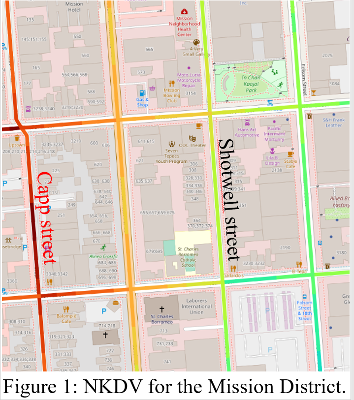

# PyNKDV: An Efficient Network Kernel Density Visualization Library for Geospatial Analytic Systems

Network kernel density visualization (NKDV) has been widely used in different applications, including traffic/traffic accident hotspot detection and crime hotspot detection. Therefore, many software packages, e.g., spNetwork (an R package) and SANET (a plugin for QGIS/ArcGIS), can also support this tool. However, all these software packages are based on the naïve implementation, which are not scalable to large-scale datasets. To overcome this weakness, we propose this python library, called PyNKDV [1], which is based on our state-of-the-art solution (ADA) [8]. PyNKDV can significantly improve the efficiency for generating NKDV compared with existing software packages.

# Usage of PyNKDV
Our PyNKDV library can clearly show hotspots in the commonly used geographic information systems, including QGIS and ArcGIS. In Figure 1, we show the hotspot map for the 311-call location dataset in the Mission District of San Francisco using QGIS. Note that the Capp Street has higher 311-call density compared with the Shotwell Street although these two streets are close to each other in terms of Euclidean distance. This shows that NKDV can provide more accurate visualization compared with the traditional kernel density visualization.

# Installation Guidelines
++TODO: add details++

# How to Use PyNKDV?
++TODO: add details++

# PyNKDV is Fast!
++TODO: add details++

# Project Members:
[Prof. (Edison) Tsz Nam Chan](https://www.comp.hkbu.edu.hk/~edisonchan/), Hong Kong Baptist University 
Mr. Rui Zang, Hong Kong Baptist University 
Mr. Pak Lon Ip, Universiy of Macau 
[Prof. (Ryan) Leong Hou U](https://www.fst.um.edu.mo/personal/ryanlhu/), Universiy of Macau 
[Prof. Jianliang Xu](https://www.comp.hkbu.edu.hk/~xujl/), Hong Kong Baptist University 

# Collaborators:
[Prof. Byron Choi](https://www.comp.hkbu.edu.hk/~bchoi/), Hong Kong Baptist University 
[Prof. Reynold Cheng](https://i.cs.hku.hk/~ckcheng/), The University of Hong Kong 
[Prof. (Ken) Man Lung Yiu](https://www4.comp.polyu.edu.hk/~csmlyiu/), Hong Kong Polytechnic University 
Dr. Zhe Li, Alibaba Cloud 
Mr. Kaiyan Zhao, Universiy of Macau 
Mr. Ye Li, University of Macau 
Mr. Weng Hou Tong, University of Macau 
Mr. Shivansh Mittal, The University of Hong Kong

# Publications:
1. Tsz Nam Chan, Rui Zang, Pak Lon Ip, Leong Hou U, Jianliang Xu. PyNKDV: An Efficient Network Kernel Density Visualization Library for Geospatial Analytic Systems. Proceedings of ACM Conference on Management of Data (SIGMOD), 2023.
2. Tsz Nam Chan, Leong Hou U, Byron Choi, Jianliang Xu, Reynold Cheng. Large-scale Geospatial Analytics: Problems, Challenges, and Opportunities. Proceedings of ACM Conference on Management of Data (SIGMOD), 2023.
3. Tsz Nam Chan, Leong Hou U, Byron Choi, Jianliang Xu, Reynold Cheng. Kernel Density Visualization for Big Geospatial Data: Algorithms and Applications. IEEE International Conference on Mobile Data Management (MDM), 2023.
4. Tsz Nam Chan, Leong Hou U, Byron Choi, Jianliang Xu. SLAM: Efficient Sweep Line Algorithms for Kernel Density Visualization. Proceedings of ACM Conference on Management of Data (SIGMOD), 2022.
5. Tsz Nam Chan, Pak Lon Ip, Kaiyan Zhao, Leong Hou U, Byron Choi, Jianliang Xu. LIBKDV: A Versatile Kernel Density Visualization Library for Geospatial Analytics. Proceedings of the VLDB Endowment (PVLDB), 2022.
6. Tsz Nam Chan, Pak Lon Ip, Leong Hou U, Byron Choi, Jianliang Xu. SWS: A Complexity-Optimized Solution for Spatial-Temporal Kernel Density Visualization. Proceedings of the VLDB Endowment (PVLDB), 2022.
7. Tsz Nam Chan, Pak Lon Ip, Leong Hou U, Byron Choi, Jianliang Xu. SAFE: A Share-and-Aggregate Bandwidth Exploration Framework for Kernel Density Visualization. Proceedings of the VLDB Endowment (PVLDB), 2022.
8. Tsz Nam Chan, Zhe Li, Leong Hou U, Jianliang Xu, Reynold Cheng. Fast Augmentation Algorithms for Network Kernel Density Visualization. Proceedings of the VLDB Endowment (PVLDB), 2021.
9. Tsz Nam Chan, Pak Lon Ip, Leong Hou U, Weng Hou Tong, Shivansh Mittal, Ye Li, Reynold Cheng. KDV-Explorer: A Near Real-Time Kernel Density Visualization System for Spatial Analysis. Proceedings of the VLDB Endowment (PVLDB), 2021.
10. Tsz Nam Chan, Reynold Cheng, Man Lung Yiu. QUAD: Quadratic-Bound-based Kernel Density Visualization. Proceedings of ACM Conference on Management of Data (SIGMOD), 2020.
11. Tsz Nam Chan, Leong Hou U, Reynold Cheng, Man Lung Yiu, Shivansh Mittal. Efficient Algorithms for Kernel Aggregation Queries. IEEE Transactions on Knowledge and Data Engineering (TKDE).
12. Tsz Nam Chan, Man Lung Yiu, Leong Hou U. KARL: Fast Kernel Aggregation Queries. IEEE International Conference on Data Engineering (ICDE), 2019.
