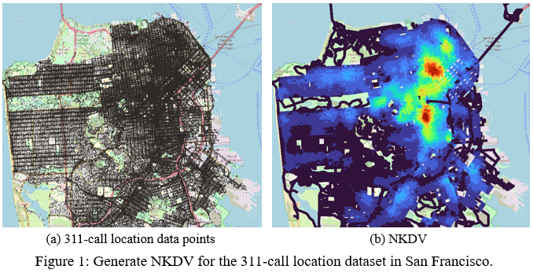
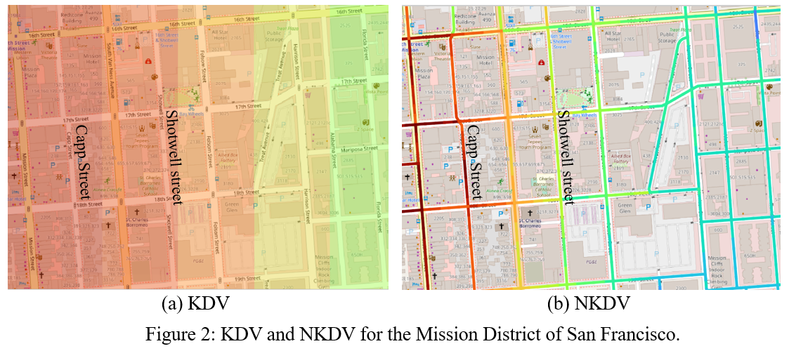
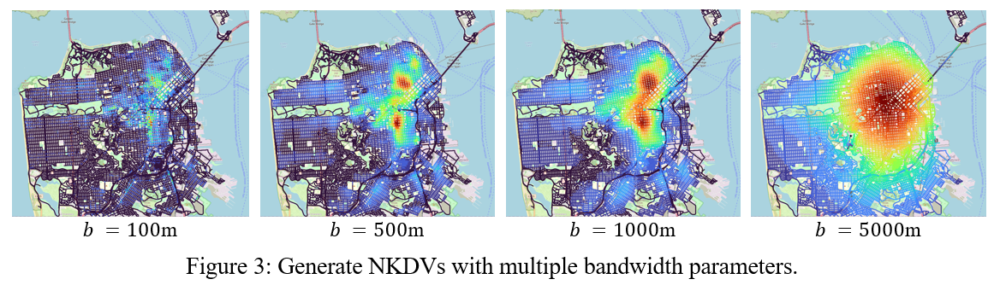

# PyNKDV: An Efficient Network Kernel Density Visualization Library for Geospatial Analytic Systems

Network kernel density visualization (NKDV) has been widely used in different applications, including traffic/traffic accident hotspot detection and crime hotspot detection. Therefore, many software packages, e.g., spNetwork (an R package) and SANET (a plugin for QGIS/ArcGIS), can also support this tool. However, all these software packages are based on the naïve implementations, which are not scalable to large-scale datasets. To overcome this weakness, we propose a new python library, called PyNKDV [1], which is based on our state-of-the-art solution (ADA) [8]. PyNKDV can significantly improve the efficiency for generating NKDV compared with existing software packages.

# Introduction to PyNKDV
Our PyNKDV library can clearly show hotspots in the commonly used geographic information systems, including QGIS and ArcGIS. In Figure 1, we show the hotspot map (based on NKDV) for the 311-call location dataset in San Francisco using QGIS. Compared with the scatter plot (cf. Figure 1a), we can clearly observe that there are two 311-call hotspot regions in San Francisco (cf. Figure 1b).

<p align="center"></p>

Compared with the commonly used kernel density visualization (KDV) tool, NKDV does not overestimate the density values for some geographical events that lie on/are along with the road network (e.g., traffic accidents and crime events). In Figure 2, we generate KDV and NKDV for the 311-call location dataset in the Mission District of San Francisco. Note that KDV tends to provide higher density (i.e., not safe) for the Shotwell Street, which is deemed to be low density using NKDV (i.e., safe).

<p align="center"></p>

PyNKDV also offers the bandwidth tuning operation for domain experts to generate multiple NKDVs based on different bandwidth parameters so that they can select one of the hotspot maps with the best quality. Using Figure 3 as an example, the hotspot map with the bandwidth parameter b = 500m is the most reasonable as it can discover more hidden patterns.

<p align="center"></p>

# Installation Guidelines:

### 1. Create a conda environment.
```
(base) ~ % conda create -n pynkdv python=3.9
```
### 2. Activate the environment.
```
(base) ~ % conda activate pynkdv
```

### 3. Install QGIS in the conda environment.
**3.1 For Win64, we recommend using mamba to install QGIS. You can choose either 3.1.1 or 3.1.2.**

3.1.1 Install mamba through conda

`(pynkdv) C:\Windows>conda install mamba -n base -c conda-forge`

`(pynkdv) C:\Windows>mamba install -c conda-forge qgis=3.28.2`


3.1.2 You can also download and install mamba miniforge from [https://github.com/conda-forge/miniforge/releases](https://github.com/conda-forge/miniforge/releases). Open miniforge prompt after installing it.

`(base) C:\Windows>conda activate pynkdv`

`(pynkdv) C:\Windows>mamba install -c conda-forge qgis=3.28.2`

**3.2 For MacOS**

`(pynkdv) ~ % conda install -c conda-forge qgis`

### 4. Install dependencies.
`(pynkdv) ~ % conda install -c conda-forge osmnx`

### 5. Install PyNKDV.
`(pynkdv) ~ % pip install pynkdv`

### 6. Open QGIS GUI.

`(pynkdv) ~ % qgis`
### 7. Open the python console in QGIS by clicking plugin and python console in the menu and get the system path from QGIS.
```
import sys
sys.path
# the result should be a list like this
['/Users/patrick/opt/anaconda3/envs/pynkdv/lib/python3.9',
         '/Users/patrick/opt/anaconda3/envs/pynkdv/lib/python3.9/lib-dynload',
         '/Users/patrick/opt/anaconda3/envs/pynkdv/lib/python3.9/site-packages',
         '/Users/patrick/Library/Application Support/QGIS/QGIS3/profiles/default/python']
```
# How to use PyNKDV?
### 1. Import our library PyNKDV, and copy the path in the Step 7 of the "Installation Guidelines" into the parameter of the method setPath.
```python
from pynkdv.PyNKDV import *

setPath(['/Users/patrick/opt/anaconda3/envs/pynkdv/lib/python3.9',
         '/Users/patrick/opt/anaconda3/envs/pynkdv/lib/python3.9/lib-dynload',
         '/Users/patrick/opt/anaconda3/envs/pynkdv/lib/python3.9/site-packages',
         '/Users/patrick/Library/Application Support/QGIS/QGIS3/profiles/default/python'])
```

### 2. Get the road data from the data file.
```
""" 
the file format (longitude, lattitude):
-122.4253831 37.77549282
-122.383407840884 37.726741475223
-122.423049926758 37.793933868408
...
"""
map_data = map_road_network(data_file)
```
Required arguments
> data_file: the name of the data file

### 3. Create the PyNKDV object and compute.
```
model = PyNKDV(map_data, bandwidth=1000, lixel_size=10, num_threads=8)
results = model.compute()
```
Required arguments
> map_data: The map_data we get from the previous step.

Optional arguments
> bandwidth: the spatial bandwidth (in terms of meters), default is 1000.
> 
> lixel_size: the length of the lixel (line segment), default is 10.
> 
> num_threads: the number of threads, default is 8.

### 4. Output the visualization results to a shapefile.
```python
output(results, output_file_name)
```
Required arguments
> results: the results from the previous step.
 
> output_file_name: The filename of the output.

# Example:
```python
from pynkdv_conda.pynkdv import *

setPath(['/Applications/QGIS.app/Contents/Resources/python', '/Applications/QGIS.app/Contents/Resources/python/plugins', '/Applications/QGIS.app/Contents/Resources/python/plugins/processing'])

map_data = map_road_network('San_Francisco_clean.csv')
model = PyNKDV(map_data, bandwidth=1000, lixel_size=10, num_threads=8)
results = model.compute()
output(results, 'output-test1')
```

# PyNKDV is Fast!
++TODO: add details++

# Project Members:
[Prof. (Edison) Tsz Nam Chan](https://www.comp.hkbu.edu.hk/~edisonchan/), Hong Kong Baptist University<br />
Mr. Rui Zang, Hong Kong Baptist University<br />
Mr. Pak Lon Ip, Universiy of Macau<br />
[Prof. (Ryan) Leong Hou U](https://www.fst.um.edu.mo/personal/ryanlhu/), Universiy of Macau<br />
[Prof. Jianliang Xu](https://www.comp.hkbu.edu.hk/~xujl/), Hong Kong Baptist University<br />

# Collaborators:
[Prof. Byron Choi](https://www.comp.hkbu.edu.hk/~bchoi/), Hong Kong Baptist University<br />
[Prof. Reynold Cheng](https://i.cs.hku.hk/~ckcheng/), The University of Hong Kong<br />
[Prof. (Ken) Man Lung Yiu](https://www4.comp.polyu.edu.hk/~csmlyiu/), Hong Kong Polytechnic University<br />
Dr. Zhe Li, Alibaba Cloud<br />
Mr. Kaiyan Zhao, Universiy of Macau<br />
Mr. Ye Li, University of Macau<br />
Mr. Weng Hou Tong, University of Macau<br />
Mr. Shivansh Mittal, The University of Hong Kong

# Publications:
1. Tsz Nam Chan, Rui Zang, Pak Lon Ip, Leong Hou U, Jianliang Xu. PyNKDV: An Efficient Network Kernel Density Visualization Library for Geospatial Analytic Systems. Proceedings of ACM Conference on Management of Data (SIGMOD), 2023.
2. Tsz Nam Chan, Leong Hou U, Byron Choi, Jianliang Xu, Reynold Cheng. Large-scale Geospatial Analytics: Problems, Challenges, and Opportunities. Proceedings of ACM Conference on Management of Data (SIGMOD), 2023.
3. Tsz Nam Chan, Leong Hou U, Byron Choi, Jianliang Xu, Reynold Cheng. Kernel Density Visualization for Big Geospatial Data: Algorithms and Applications. IEEE International Conference on Mobile Data Management (MDM), 2023.
4. Tsz Nam Chan, Leong Hou U, Byron Choi, Jianliang Xu. SLAM: Efficient Sweep Line Algorithms for Kernel Density Visualization. Proceedings of ACM Conference on Management of Data (SIGMOD), 2022.
5. Tsz Nam Chan, Pak Lon Ip, Kaiyan Zhao, Leong Hou U, Byron Choi, Jianliang Xu. LIBKDV: A Versatile Kernel Density Visualization Library for Geospatial Analytics. Proceedings of the VLDB Endowment (PVLDB), 2022.
6. Tsz Nam Chan, Pak Lon Ip, Leong Hou U, Byron Choi, Jianliang Xu. SWS: A Complexity-Optimized Solution for Spatial-Temporal Kernel Density Visualization. Proceedings of the VLDB Endowment (PVLDB), 2022.
7. Tsz Nam Chan, Pak Lon Ip, Leong Hou U, Byron Choi, Jianliang Xu. SAFE: A Share-and-Aggregate Bandwidth Exploration Framework for Kernel Density Visualization. Proceedings of the VLDB Endowment (PVLDB), 2022.
8. Tsz Nam Chan, Zhe Li, Leong Hou U, Jianliang Xu, Reynold Cheng. Fast Augmentation Algorithms for Network Kernel Density Visualization. Proceedings of the VLDB Endowment (PVLDB), 2021.
9. Tsz Nam Chan, Pak Lon Ip, Leong Hou U, Weng Hou Tong, Shivansh Mittal, Ye Li, Reynold Cheng. KDV-Explorer: A Near Real-Time Kernel Density Visualization System for Spatial Analysis. Proceedings of the VLDB Endowment (PVLDB), 2021.
10. Tsz Nam Chan, Reynold Cheng, Man Lung Yiu. QUAD: Quadratic-Bound-based Kernel Density Visualization. Proceedings of ACM Conference on Management of Data (SIGMOD), 2020.
11. Tsz Nam Chan, Leong Hou U, Reynold Cheng, Man Lung Yiu, Shivansh Mittal. Efficient Algorithms for Kernel Aggregation Queries. IEEE Transactions on Knowledge and Data Engineering (TKDE).
12. Tsz Nam Chan, Man Lung Yiu, Leong Hou U. KARL: Fast Kernel Aggregation Queries. IEEE International Conference on Data Engineering (ICDE), 2019.
